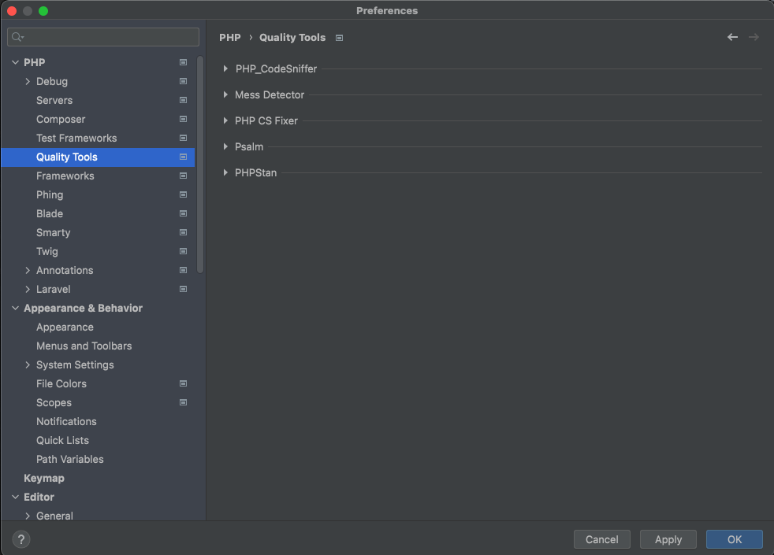
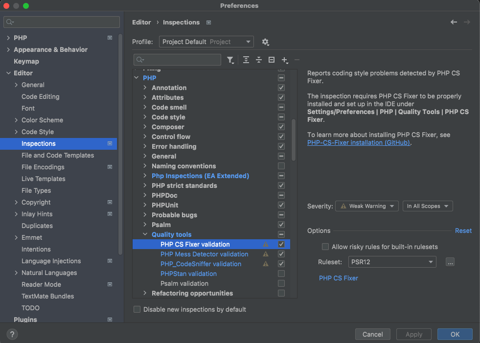
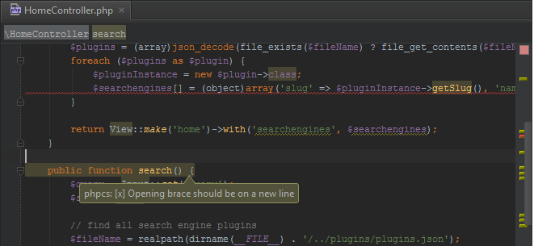

PHP Code Quality Tools
---

Code reviews are processes where software developers and testers check if an already written source code complies with coding conventions and standards.

Apart from manual code reviews, static and dynamic code analysis can also be conducted with the help of automated tools.

* Static code analysis tools examine the source code without executing it. 
* Dynamic analysis is conducted while the code, or a part/unit of it (for example unit or integration testing) is being run.

The more you will modify your application, the more the application has chances to break. Your application will inevitably become more complex.

These PHP code quality tools can definitely help you in that matter. 
Since your codebase will be more and more buggy, refactoring is a necessity and these tools can show you where to start. 
On a daily basis, they can give you good advice on all these little things you need to take care of to keep your codebase healthy.

Static code analysis tools are a good complement but not a replacement for a solid test suites.

## Why is code quality important?

* Adding new features becomes increasingly difficult, while potentially breaking existing ones in the process.
* Bug fixes take up more of the team’s time, missing deadlines and prolonging crucial updates.
* On-boarding new developers requires more time if the code base is hard to read and understand.
* Future development estimations also become less accurate if it’s impossible to predict how long it takes to add new features without breaking existing ones.

## Code quality tools

There are a lot of PHP static code analysis tool, the most used ones are : 

#### [PHP-CS-Fixer - PHP Coding Standards Fixer](https://github.com/FriendsOfPHP/PHP-CS-Fixer)
The PHP Coding Standards Fixer (PHP CS Fixer) tool automatically fixes your code to follow standards; whether you want to follow PHP coding standards as defined in the PSR-1, PSR-2, etc., or other community driven ones like the Symfony one. 
You can also define your (team's) style through configuration.

It can modernize your code (like converting the pow function to the ** operator) and micro optimize it.

PHP-CS-Fixer will help you have a consistent code style which will be easier to read and will free your mind for more important questions.

With the following command you can format an entire codebase: `$ php-cs-fixer fix src/`

 

#### [PHPCS - PHP CodeSniffer](https://github.com/squizlabs/PHP_CodeSniffer)
PHP CS Fixer is for full automated, but it can't fix everything for you and won't lint your code in the IDE.
PHP CodeSniffer will fill out that gap. It's a very good tool to output the coding standards violations you have in your codebase.

PHP_CodeSniffer is a set of two PHP scripts; the main `phpcs` script that tokenizes PHP, JavaScript and CSS files to detect violations of a defined coding standard, and a second `phpcbf` (PHP Code Beautifier and Fixer) script to automatically correct coding standard violations. 
PHP_CodeSniffer is an essential development tool that ensures your code remains clean and consistent.

With the following command you can print all the code standards violation in your entire codebase: `$ php-cs-fixer fix src/`
Some of these code violation can be fixed by running : `phpcbf app/`

 

#### [PHPMD - PHP Mess Detector](https://github.com/phpmd/phpmd)
PHP Mess Detector takes a given PHP source code base and look for several potential problems within that source. 

A code smell is a term describing suspicious code constructions. These might not be errors or bugs per se but are most likely problematic from the object-oriented programming (OOP) perspective.

Smells are certain structures in the code that indicate violation of fundamental design principles and negatively impact design quality.
Code smells are usually not bugs; they are not technically incorrect and do not prevent the program from functioning. 
Instead, they indicate weaknesses in design that may slow down development or increase the risk of bugs or failures in the future.

These problems can be things like:

* Possible bugs
* Duplicated code
* Methods with too many parameters
* Over bloated methods
* Excessively long lines of code
* Suboptimal code
* Overcomplicated expressions
* Unused parameters, methods, properties

 

#### [PHPStan - PHP Static Analysis Tool](https://github.com/phpstan/phpstan)
PHPStan looks for common issues and will verify type compatibility on various operations when type information is available or can be deduced.

Stan is able to perform the following kinds of analysis:

* Check that all methods, functions, classes, traits, interfaces, constants, properties and variables are defined and accessible.
* Check for type safety and arity issues on method/function/closure calls.
* Check for PHP8/PHP7/PHP5 backward compatibility.
* Check for valid and type safe return values on methods, functions, and closures.
* Check for redundant or impossible conditions and pointless casts.
* Checks phpdoc type annotations.

## In Your Terminal
You can install and run these quality tools from your terminal by using these commands.

* PHP-CS-Fixer : `composer global require friendsofphp/php-cs-fixer:*` , `php-cs-fixer fix app/`
* PHPCS :        `composer global require "squizlabs/php_codesniffer=*"`   , `phpcs app/`, `phpcbf app/`
* PHPMD :        `composer global require "phpmd/phpmd=@stable"` , `phpmd app/ text cleancode`
* PHPStan :      `composer global require phpstan/phpstan` , `stan analyse --memory-limit=512M`

## [In PHPStorm](https://www.jetbrains.com/help/phpstorm/php-code-quality-tools.html)
This guide will explain how to add these quality tools to PHPStorm.
After installing the code quality tools via composer you will need to add the path to the different tools in PHP => Quality Tools.

Once you have installed and linked the binary files in the PHP Quality tools you can configure them in the Editor inspections window.

Once everything is set up you can run these inspections by going to Code => Inspect Code or you can see them right in your editor.

*Code sniffer example :*

## Usage In GITHUB ACTIONS 
GitHub Actions is a continuous integration and continuous delivery (CI/CD) platform that allows you to automate your build, test, and deployment pipeline. 
You can create workflows that build and test every pull request to your repository, or deploy merged pull requests to different environments.

[PHPMD](https://phpmd.org/documentation/ci-integration.html)

[PHP-CS-FIXER](https://stefanzweifel.io/posts/run-prettier-or-php-cs-fixer-with-github-actions)

[PHP-CS](https://github.com/marketplace/actions/action-php-codesniffer)

[PHPSTAN](https://github.com/php-actions/phpstan)

Usage : Check actions/styles.yaml for usage example.
